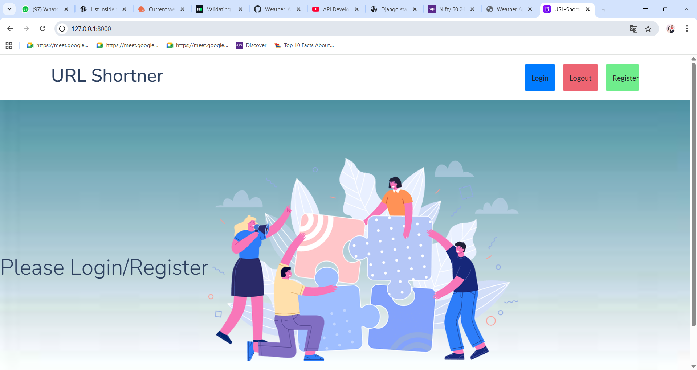

# 🔗 URL Shortener with Login System

A secure and user-based URL shortener built with Django and MySQL. This app allows registered users to shorten URLs, track them, and ensures that each user can only create **one unique short URL per website**. Shortcodes are generated using a mix of **random strings and Base62 encoding** of the database ID, ensuring uniqueness and security.

---

## ✨ Features

- 🔒 **Login system** – only authenticated users can shorten URLs
- 👤 Each user gets **user-specific short URLs**
- 🧠 Prevents duplicate shortcodes per user for the same original URL
- 🧮 **Shortcode generation** using random string + Base62(id)
- 💽 Integrated with **MySQL Workbench**
- 📦 Clean Django structure with models, views, and templates
- 📷 Screenshot preview included

---

## 📸 Screenshots

### 🔐 Main Page  

### 🔐 Login Page  

### 🔗 URL Shortener Form  

### 🔁 Shortened URL Result  

---
