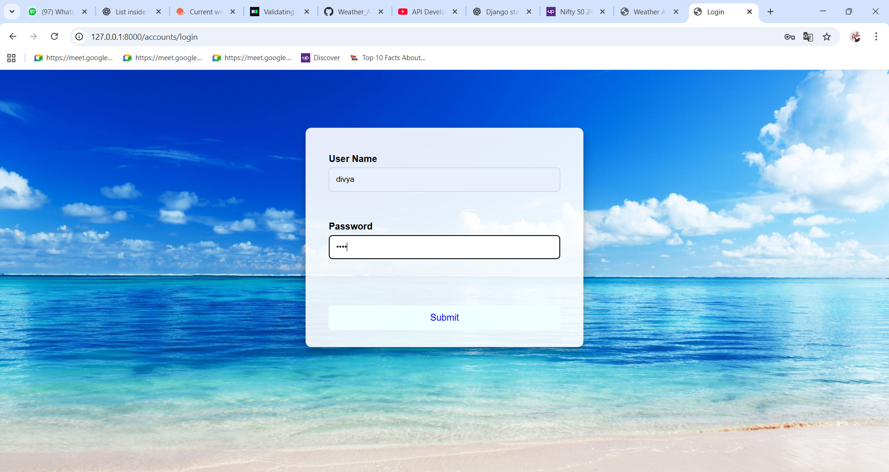
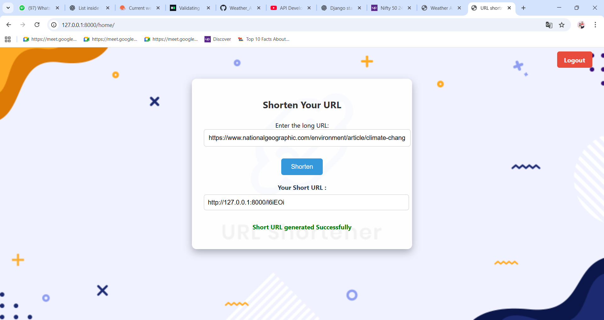

# 🔗 URL Shortener with Login System

A secure and user-based URL shortener built with Django and MySQL. This app allows registered users to shorten URLs, track them, and ensures that each user can only create **one unique short URL per website**. Shortcodes are generated using a mix of **random strings and Base62 encoding** of the database ID, ensuring uniqueness and security.

---

## ✨ Features

- 🔒 **Login system** – only authenticated users can shorten URLs
- 👤 Each user gets **user-specific short URLs**
- 🧠 Prevents duplicate shortcodes per user for the same original URL
- 🧮 **Shortcode generation** using random string + Base62(id)
- 💽 Integrated with **MySQL Workbench**
- 📦 Clean Django structure with models, views, and templates
- 📷 Screenshot preview included

---

## 📸 Screenshots

###  Main Page  


### 🔐 Login Page  


### Registration Page


### 🔗 URL Shortener Form  


### 🔁 Shortened URL Result  


---

## 💻 Tech Stack

- **Python 3.13.3**
- **Django**
- **MySQL** (using MySQL Workbench)
- **HTML + Bootstrap**
- **Random + Base62** (for generating shortcodes)

---

## 🚀 Setup Instructions

1. **Clone the repository:**

```bash
git clone https://github.com/your-username/url-shortener.git
cd url-shortener
```
2.**Create and activate a virtual environment:**

```bash
python -m venv env
source env/bin/activate      # Windows: env\Scripts\activate
```
3.**Install dependencies:**

```bash

pip install -r requirements.txt
```
4.**Configure database:**

Open MySQL Workbench

Create a new schema/database (e.g., urlshortener_db)

In settings.py, update the DATABASES section with your credentials:

python

DATABASES = {

    'default': {
    
        'ENGINE': 'django.db.backends.mysql',
        
        'NAME': 'urlshortener_db',
        
        'USER': 'your_mysql_username',
        
        'PASSWORD': 'your_mysql_password',
        
        'HOST': 'localhost',
        
        'PORT': '3306',
        
    }
}

5.**Run migrations:**

```bash

python manage.py makemigrations
python manage.py migrate
```
6.**Create a superuser (for admin login):**

```bash

python manage.py createsuperuser
```
7.**Start the development server:**

```bash

python manage.py runserver
```
8.**Visit the app in your browser:**

http://127.0.0.1:8000/

🧠 **How Shortcodes Are Generated**

Each short URL code is a unique 6-character string created using the following logic:

1. Get the database ID of the original URL (automatically generated when the URL is saved in the database).

2. Convert the ID to Base62:

   Base62 uses digits (0–9), lowercase letters (a–z), and uppercase letters (A–Z) — a total of 62 characters.

   This makes the encoded value short and URL-friendly.

   Example: If the ID is 125, the Base62 equivalent might be something like 21.

3. Calculate how many characters are needed to complete a 6-character short code:

   If the Base62 encoded part is 2 characters (21), then we need 4 more characters to make the total length 6.

   Generate a random string using characters from the Base62 character set to fill the remaining length.

   Combine the random string + Base62-encoded ID to form the final short code.

   Example: Random part = aZ1x, Base62 ID part = 21 → Final shortcode = aZ1x21

4. Ensure uniqueness per user:

   Each user can only have one short code for a specific long URL.

   If the same user tries to shorten the same URL again, the existing shortcode is returned.
  
🔐 **Authentication Logic**

   Only logged-in users can create shortened URLs

   Each user can shorten the same original URL only once

   URLs are user-specific — multiple users can shorten the same site independently
